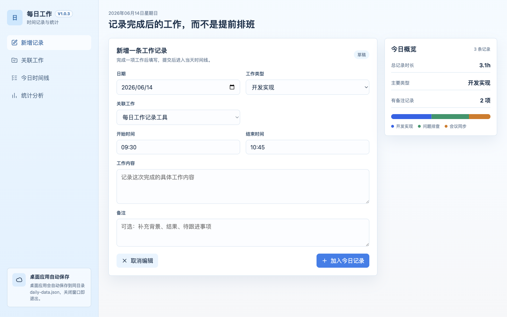
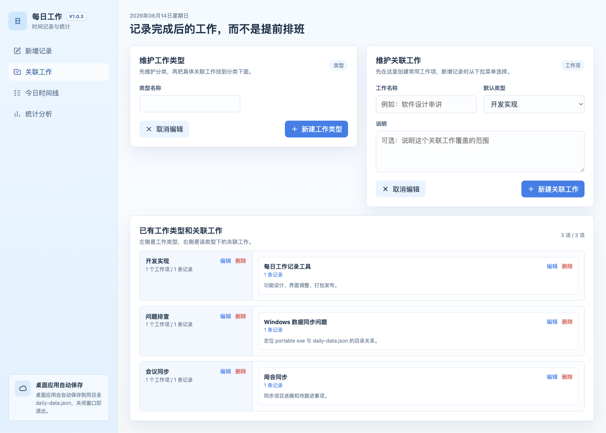
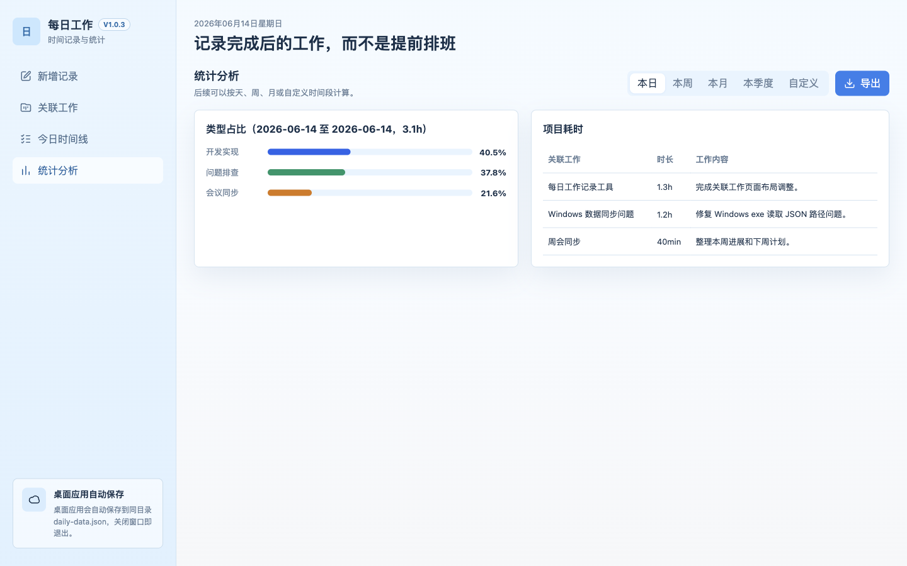

# 每日工作时间记录

一个用于记录“已经完成的工作”的本地桌面应用。每次完成一项工作后，记录工作类型、关联工作、工作内容、备注、开始时间和结束时间；应用会自动写入同目录的 `daily-data.json`，方便放在百度云盘等同步目录里多设备使用。

当前版本：`V1.0.3`

## 主要功能

- 新增每日工作记录，按完成后的实际时间填写。
- 维护工作类型和关联工作，新增记录时按工作类型筛选关联工作。
- 查看当天时间线。
- 按日、周、月、季度、自定义时间范围统计工作占比。
- 导出 Markdown 汇报内容，方便复制到周报、月报或 AI 工具中继续整理。
- 数据保存到应用同目录的 `daily-data.json`，不依赖账号或云端数据库。

## 使用方式

### macOS

双击打开：

```text
每日工作记录.app
```

### Windows

双击打开：

```text
每日工作记录.exe
```

应用会读取同目录下的：

```text
daily-data.json
```

所以建议目录结构保持为：

```text
每日工作记录/
├── 每日工作记录.app        # macOS 使用
├── 每日工作记录.exe        # Windows 使用
└── daily-data.json         # 真实工作数据
```

`daily-data.json` 是你的核心数据文件。更新应用时不要删除或覆盖它。

## 图文教程

### 1. 新增工作记录

完成一项工作后，在“新增记录”页面填写日期、工作类型、关联工作、开始时间、结束时间、工作内容和备注。



### 2. 维护工作类型和关联工作

先维护工作类型，再维护关联工作。已有工作类型和工作项会在下方左右分组展示。



### 3. 统计分析和导出

在“统计分析”页面选择日、周、月、季度或自定义时间范围，查看类型占比和关联工作汇总。点击“导出”可以生成 Markdown 汇报内容。



## 数据同步建议

把整个应用目录放到百度云盘同步目录中，例如：

```text
Baidu/每日工作记录/
```

多台电脑同步时，重点同步这三个内容：

- `每日工作记录.app`
- `每日工作记录.exe`
- `daily-data.json`

其中 `daily-data.json` 保存真实记录；`.app` 和 `.exe` 是应用本体。

## 开发命令

安装依赖：

```bash
npm install
```

本地启动：

```bash
npm run desktop
```

测试：

```bash
npm test
```

构建 macOS 应用：

```bash
npm run build:mac
```

构建 Windows exe：

```bash
npm run build:win
```

构建产物默认在：

```text
dist/mac-arm64/每日工作记录.app
dist/每日工作记录.exe
```

## GitHub Release 怎么发布

Release 是 GitHub 提供的“版本发布页”。你可以把构建好的 `exe`、`app.zip` 上传到 Release，别人就能直接下载。

手动发布流程：

1. 先本地构建：

   ```bash
   npm run build:mac
   npm run build:win
   ```

2. 把 macOS 的 `.app` 压缩成 zip。因为 `.app` 本质是一个目录，不能像 exe 一样直接当单文件上传：

   ```bash
   ditto -c -k --sequesterRsrc --keepParent "dist/mac-arm64/每日工作记录.app" "dist/每日工作记录-mac.zip"
   ```

3. 打开 GitHub 仓库的 Releases 页面：

   ```text
   https://github.com/tanqingkuang/Daily/releases
   ```

4. 点击 `Draft a new release`。

5. 填写 tag，例如：

   ```text
   v1.0.3
   ```

6. 上传附件：

   ```text
   dist/每日工作记录.exe
   dist/每日工作记录-mac.zip
   ```

7. 发布后，GitHub 页面就会出现可下载的 exe 和 mac zip。

后续也可以配置 GitHub Actions，让每次创建 tag 时自动构建并上传 Release 附件。

## 数据格式

`daily-data.json` 当前格式：

```json
{
  "schemaVersion": 1,
  "workTypes": [],
  "workItems": [],
  "records": []
}
```

目前 `V1.0.3` 没有修改数据格式。
